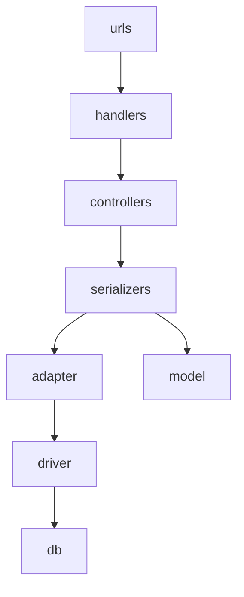

# applet

cd src/
export LC_ALL=C
pip3 install -r requirements.txt

# 接口安装

docker build -t 10.10.10.10/library/applet/arm64v8/others:0.0.1 .

docker run -it -d -v /data:/data -p 80:80 10.10.10.10/library/applet/arm64v8/others:0.0.1 bash

# 代码结构图

